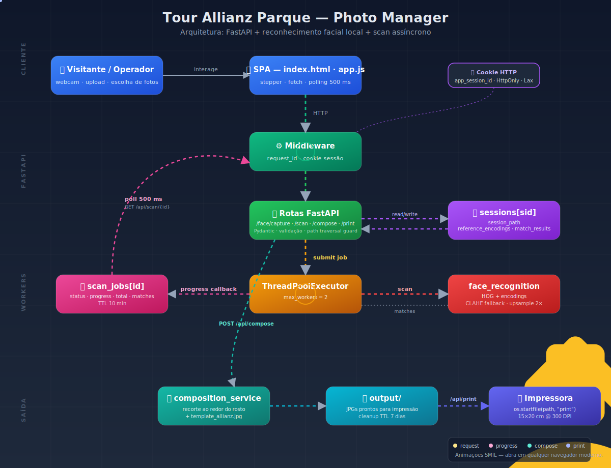

# Tour Allianz Parque — Photo Manager

Aplicação web local para identificar visitantes em fotos do tour do Allianz Parque por reconhecimento facial, compor as imagens com o template oficial (rodapé da marca) e enviá-las direto para a impressora.

O fluxo é desenhado para um operador presencial: o visitante posa para a câmera (ou envia uma foto), o sistema procura todas as fotos do dia em que ele aparece, o operador escolhe quais imprimir, e elas saem prontas no tamanho 15×20 cm.

---

## Arquitetura em uma frase

FastAPI + reconhecimento facial local (`face_recognition`/dlib), com estado por sessão isolado via cookie HTTP, scan assíncrono em pool de threads e frontend single-page em HTML/CSS/JS puro.



> Diagrama animado em SVG (SMIL) mostrando o fluxo request → middleware → routes → ThreadPoolExecutor → face_recognition, polling de jobs, e composição/impressão. Abra em qualquer navegador moderno para ver as animações.

---

## Stack

| Camada | Tecnologia |
| --- | --- |
| Backend HTTP | FastAPI + Uvicorn |
| Reconhecimento facial | `face_recognition` (dlib HOG por padrão) |
| Visão computacional auxiliar | OpenCV (CLAHE para enhancement, redimensionamento) |
| Imagem | Pillow (EXIF, compose, thumbnails) |
| Impressão | `pywin32` — `win32api.ShellExecute("printto", ...)` direto para a impressora padrão (Windows) |
| Frontend | HTML + CSS (tokens + base + components + screens + overlays) + JavaScript vanilla, sem framework |
| Face detection ao vivo | MediaPipe Face Detection (vendored, ESM) — overlay de bbox na captura |
| Picker de pastas nativo | `tkinter.filedialog` em thread isolada |
| Testes | `pytest` + `httpx` (via `fastapi.testclient`) |

Sem banco de dados. Estado vive em memória por processo, indexado por cookie de sessão HTTP.

---

## Estrutura do projeto

```
ESP/
├── server.py                        # FastAPI app: rotas, middleware, jobs
├── start.bat                        # Starter Windows: ativa venv e sobe uvicorn
├── requirements.txt
├── README.md
├── app/
│   ├── config.py                    # Caminhos, dimensões, parâmetros do detector
│   └── services/
│       ├── face_service.py          # Detecção, encoding, scan_session
│       └── composition_service.py   # Compose com template, save, recorte
├── static/
│   ├── index.html                   # Stepper de 4 passos
│   ├── app.js                       # Lógica de UI + chamadas à API
│   ├── theme.js                     # Toggle dark/light mode
│   ├── face-detection.js            # MediaPipe bridge (window.__faceDetect)
│   ├── _icons.svg                   # Sprite de ícones
│   ├── styles/
│   │   ├── tokens.css               # Design tokens (cores, spacing, typography)
│   │   ├── base.css                 # Reset + elementos globais
│   │   ├── components.css           # Botões, cards, inputs
│   │   ├── screens.css              # Layouts por step
│   │   └── overlays.css             # Modais (confirm dialog, loading, alerts)
│   └── vendor/                      # MediaPipe Face Detection (ESM)
├── footer_template/
│   └── template_allianz.jpg         # Rodapé que vai em todas as composições
├── docs/
│   ├── architecture.svg             # Diagrama animado
│   ├── fix-print-apply.reg          # Fix do registro Windows: verbo "print" para imagens
│   └── fix-print-backup.reg         # Backup do valor quebrado (reverter se necessário)
├── uploads/<YYYYMMDDHHMM>/          # Pastas de "sessão de fotos do dia"
├── output/                          # Composições prontas (TTL 7 dias)
└── tests/
    ├── test_routes.py               # 28 testes de rotas/contratos
    ├── test_mobile_scan_regression.py
    └── test_loading_component_contract.py
```

---

## Como rodar localmente

### Pré-requisitos

- **Python 3.10+** (testado em 3.14)
- **Windows** para a função de impressão (usa `pywin32` + `ShellExecute("printto")`); o resto roda em qualquer SO
- **dlib** compila C++ — em Windows, instale via wheel pré-compilado ou tenha o Visual C++ Build Tools

### Setup (primeira vez)

```bash
python -m venv venv
venv\Scripts\activate          # Windows
# source venv/bin/activate     # Linux/macOS

pip install -r requirements.txt
```

### Subir o servidor

**Windows (recomendado) — duplo-clique em [start.bat](start.bat):**

O script verifica se a `venv` existe, instala dependências se faltarem, abre o navegador em `http://127.0.0.1:8000` e mantém o servidor rodando. `Ctrl+C` na janela encerra. Se você prefere terminal:

```cmd
start.bat
```

**Modo manual (qualquer SO):**

```bash
# Desenvolvimento (auto-reload)
uvicorn server:app --host 127.0.0.1 --port 8000 --reload

# Produção local
uvicorn server:app --host 0.0.0.0 --port 8000
```

Abrir [http://127.0.0.1:8000](http://127.0.0.1:8000) no navegador.

> **Nota Windows:** se a porta 8000 ficar travada após `Ctrl+C` (TCP socket fantasma), use outra porta (`--port 8001`).

---

## Fluxo de uso (4 passos)

1. **Sessão** — operador escolhe a pasta com as fotos do dia (clica "Procurar" para picker nativo, cola o caminho, ou usa uma das pastas recentes — armazenadas em `localStorage`).
2. **Captura** — visitante posa para a webcam ("Capturar Rosto") ou envia uma foto da galeria ("Enviar Foto"). Um ou mais rostos podem ser registrados como referência. "Limpar Rostos" zera as referências.
3. **Fotos** — backend faz scan assíncrono de toda a pasta. Frontend mostra progresso real em tempo real. Cada foto encontrada vira um card com confidence, checkbox e seletor paisagem/retrato. "Selecionar Todas" alterna seleção. "Compor e Imprimir" segue ao próximo passo.
4. **Impressão** — preview das composições prontas (foto + template). Botões para imprimir todas ou voltar.

---

## API HTTP

Todas as respostas são JSON. Cookies de sessão são gerenciados automaticamente pelo middleware.

### Sessão

| Método | Rota | Descrição |
| --- | --- | --- |
| `GET` | `/api/sessions` | Lista pastas em `uploads/` |
| `GET` | `/api/browse-folder` | Abre picker nativo, retorna caminho selecionado |
| `POST` | `/api/session/select` | Body `{path}` — registra a pasta ativa para a sessão |

### Reconhecimento facial

| Método | Rota | Descrição |
| --- | --- | --- |
| `POST` | `/api/face/capture` | Multipart `file` — extrai e salva encodings de referência |
| `POST` | `/api/face/clear` | Limpa todas as referências da sessão |

### Scan assíncrono

| Método | Rota | Descrição |
| --- | --- | --- |
| `POST` | `/api/scan` | Inicia job; retorna `{job_id}` |
| `GET` | `/api/scan/{job_id}` | Polling — `{status, progress, total, matches?}` |

`status` ∈ `{pending, running, done, error}`. Frontend faz polling a cada **500 ms**. Cross-session retorna **403**, job inexistente retorna **404**.

### Composição e impressão

| Método | Rota | Descrição |
| --- | --- | --- |
| `POST` | `/api/compose` | Body `{selected, orientations}` — retorna `{files: [{output, original, filename}]}` |
| `POST` | `/api/print` | Body `{files}` — envia para impressora padrão (Windows) |

### Arquivos

| Método | Rota | Descrição |
| --- | --- | --- |
| `GET` | `/api/photo?filename=` | Serve foto da sessão atual (validada contra a pasta) |
| `GET` | `/api/output/{filename}` | Serve composição (validada contra `output/`) |

### Headers e cookies

- `x-request-id` — correlation ID (8 hex). Eco no response, presente em todos os logs.
- `Set-Cookie: app_session_id=…; HttpOnly; Max-Age=2592000; SameSite=lax` — emitido na primeira request, reutilizado nas seguintes.

---

## Endurecimento (security)

- **Path traversal:** `_is_within(child, parent)` resolve via `os.path.realpath` e compara com `os.path.commonpath`. Tanto `/api/photo` quanto `/api/output/{filename}` validam que o caminho final está dentro de seu diretório-base.
- **Filename hardening em `/api/output`:** rejeita `/`, `\`, `..` e exige extensão em `.jpg/.jpeg/.png`.
- **Limite de upload:** `MAX_UPLOAD_BYTES = 50 MB`; arquivos maiores → `413`.
- **Validação de imagem:** `Image.verify()` antes de processar; arquivo vazio → `400`, conteúdo inválido → `400`.
- **Cookie HttpOnly + SameSite=Lax** — protege contra leitura via JS e CSRF cross-site.
- **Pydantic** valida bodies (`SelectSessionRequest`, `ComposeRequest`, `PrintRequest`); campos faltantes → `422`.

---

## Multi-usuário

Estado é per-session, não global. Cada cookie `app_session_id` mapeia para um dicionário próprio em `sessions: dict[str, dict]`:

```python
{
  "session_path": str | None,
  "reference_encodings": list[np.ndarray],
  "match_results": list[MatchResult],
}
```

Dois operadores em abas diferentes (mesma máquina) ou dois visitantes em terminais diferentes não veem dados um do outro.

---

## Scan assíncrono e jobs

`face_service.scan_session` é CPU-intensivo (HOG + encodings). Para não bloquear o event loop nem deixar o request HTTP pendurado:

1. `POST /api/scan` cria um `job_id`, registra em `scan_jobs`, submete `_run_scan_job` para `ThreadPoolExecutor(max_workers=2)`, e retorna imediatamente.
2. Worker chama `scan_session(..., progress_callback=cb)`. O callback atualiza `job["progress"]` e `job["total"]` em tempo real.
3. `GET /api/scan/{job_id}` lê o snapshot do job. O frontend faz polling até `status == "done"` ou `"error"`.
4. Jobs finalizados são limpos automaticamente após **10 min** (`SCAN_JOB_TTL_SECONDS`).
5. Validação de ownership: `job["session_id"]` precisa bater com o cookie do requerente, senão `403`.

---

## Logging

Todos os logs carregam o `request_id` (`ContextVar` + `logging.Filter`):

```
2026-04-18 00:42:33,317 [88190ff7] INFO server: scan job 5d1f… queued (sid=46a51b5d, path=…)
```

`SCAN_DIAG` e `CAPTURE_DIAG` são linhas JSON com diagnóstico do detector (brightness, sharpness, faces detectadas, distância). Use `grep SCAN_DIAG` para auditar uma sessão.

---

## Configurações relevantes ([app/config.py](app/config.py))

| Constante | Padrão | Efeito |
| --- | --- | --- |
| `FACE_TOLERANCE` | `0.70` | Distância máx. para considerar match. Maior = mais inclusivo |
| `FACE_DETECTION_MODEL` | `"hog"` | `"hog"` (CPU, rápido) ou `"cnn"` (GPU, mais preciso) |
| `FACE_SCAN_MAX_WIDTH` | `1200` | Downscale antes do scan (acelera, sem perder rostos) |
| `FACE_UPSAMPLE` | `2` | Quantas vezes upsamplear para achar rostos pequenos |
| `THUMBNAIL_SIZE` | `(240, 160)` | Tamanho do thumb no grid |
| `OUTPUT_TTL_DAYS` | `7` (em [server.py](server.py)) | Idade máx. de arquivos em `output/` antes de cleanup no startup |
| `SCAN_JOB_TTL_SECONDS` | `600` (em [server.py](server.py)) | Tempo até GC de jobs concluídos |
| `MAX_UPLOAD_BYTES` | `50 MB` (em [server.py](server.py)) | Tamanho máx. de upload |

---

## Composição

`composition_service.compose_photo(photo_path, orientation, face_locations)`:

1. Carrega a foto, aplica EXIF transpose.
2. Recorta inteligentemente em torno dos rostos detectados (se `face_locations` foi fornecido), respeitando o aspect ratio escolhido (paisagem 20×15 cm ou retrato 15×20 cm a 300 DPI).
3. Cola a foto recortada acima da área do rodapé.
4. Sobrepõe `footer_template/template_allianz.jpg` no rodapé.
5. Salva em `output/<basename>_composed.jpg`.

A função de impressão chama `win32api.ShellExecute(0, "printto", path, f'"{printer}"', ".", 0)` em loop para cada arquivo, enviando direto para a impressora padrão retornada por `win32print.GetDefaultPrinter()` — **sem abrir diálogo de impressão**. **Não funciona em Linux/macOS** — substituir por `lp` ou `lpr` se precisar.

> **Fix de registro Windows:** se ao imprimir o sistema abrir o visualizador de imagens em vez de enviar para a impressora, o verbo `print` do seu registro está apontando para `ImageView_Fullscreen`. Rode [docs/fix-print-apply.reg](docs/fix-print-apply.reg) como administrador (botão direito → "Mesclar") para apontar corretamente para `ImageView_PrintTo`. Para reverter, rode [docs/fix-print-backup.reg](docs/fix-print-backup.reg).

---

## Testes

```bash
pytest tests/test_routes.py -v
```

`tests/test_routes.py` tem **28 testes** organizados em blocos:

- **Cookie/sessão** — primeira request emite cookie, requests subsequentes reutilizam, `x-request-id` é ecoado.
- **Validação Pydantic** — `path` faltando ou vazio → `422`; bodies vazios em `/api/compose` e `/api/print` são aceitos como no-op.
- **Upload** — vazio → `400`, inválido → `400`, oversize → `413`, imagem válida sem rosto → `200 ok=false`.
- **Path traversal** — `/api/photo?filename=../../etc/passwd` → `400`; `/api/output/evil.exe` → `400`; `/api/output/sub/x.jpg` → `404` (slash não casa a rota); `/api/output/..hidden.jpg` → `400`.
- **Scan job lifecycle** — sem sessão → `400`, sem face → `400`, job inexistente → `404`, cross-session → `403`, ciclo completo (POST → polling → done com `matches`).
- **Helpers** — `_is_within` rejeita traversal, `_cleanup_old_outputs` deleta apenas arquivos antigos.

`tests/test_mobile_scan_regression.py` valida que fotos com EXIF orientation 6/8 (modo retrato de celular) são corretamente transpostas antes da detecção.

---

## Limitações conhecidas

- **Estado em memória.** Reiniciar o uvicorn perde sessões e jobs. Para deploy multi-worker, mover para Redis ou similar.
- **Impressão é Windows-only.** Depende de `pywin32` e do shell do Windows. Em Linux/macOS precisa ser reescrita para `lp`/`lpr`.
- **Reconhecimento HOG** não detecta rostos em fotos muito escuras ou muito pequenas. O scan já tenta CLAHE como fallback, mas não há garantia.
- **Tkinter folder picker** abre uma janela nativa — não funciona em deploy headless.
- **Sem autenticação.** O sistema assume operação local em rede confiável. Não exponha em internet pública sem um proxy reverso com auth.

---

## Troubleshooting rápido

| Problema | Causa provável | Como resolver |
| --- | --- | --- |
| `[Errno 10048] error while attempting to bind` | Porta já em uso ou socket fantasma do Windows | Trocar `--port` ou aguardar 1–2 min |
| Scan retorna 0 matches mesmo com a pessoa visível | Foto rotacionada via EXIF, ou foto muito pequena | Confirme que `FACE_UPSAMPLE` está em ≥2 e que o detector encontra o rosto na referência |
| `dlib` não instala | Falta de C++ compiler no Windows | Instale Visual C++ Build Tools ou use um wheel pré-compilado |
| `ModuleNotFoundError: win32api` | `pywin32` não instalado na venv | `venv\Scripts\pip.exe install pywin32` |
| Impressão abre o visualizador em vez de imprimir | Verbo `print` do registro aponta para `ImageView_Fullscreen` | Rodar [docs/fix-print-apply.reg](docs/fix-print-apply.reg) como admin |
| Impressão não dispara | Sem impressora padrão configurada | Verifique em "Configurações → Impressoras" e marque uma como padrão |
| Frontend não atualiza após edit | Cache do navegador | `Ctrl+F5` para hard reload |

---

## Licença

Uso interno NTT DATA / Allianz Parque. Não há licença open source aplicada.
